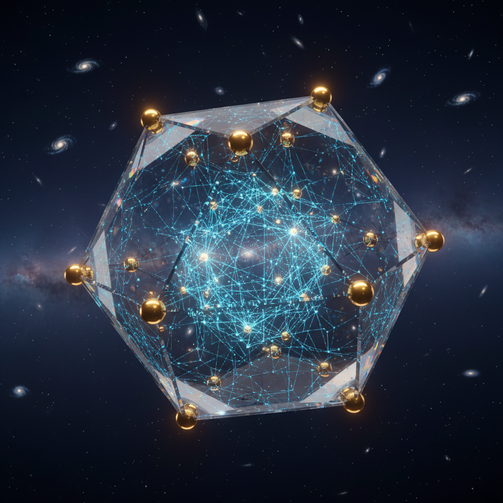
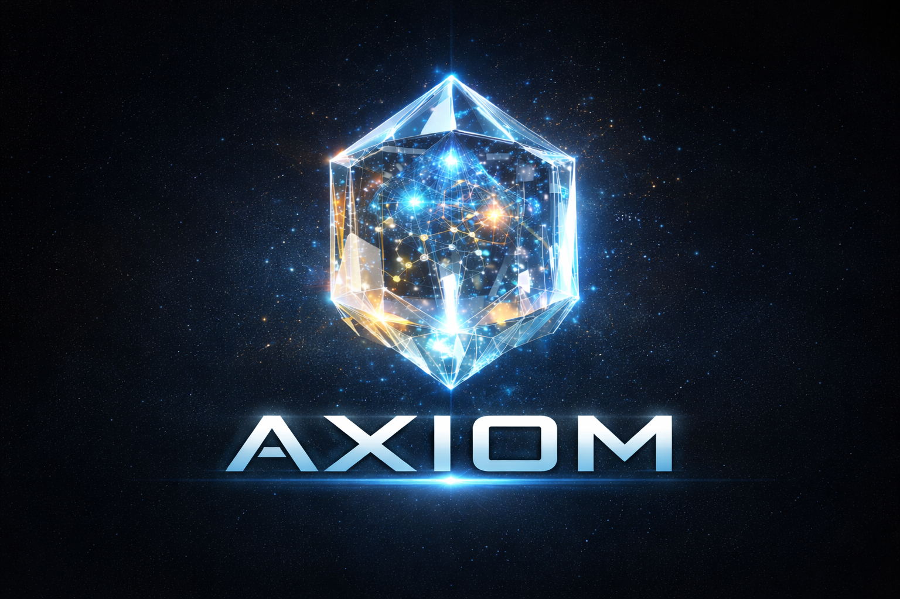

<div align="center">
  

  <br>
  
  <br><br>

  # Axiom

  ### Sovereign Proof Engine for Molecular Binding

  [](#)
  [](#)
  [](#license)

  [](#mathematical-framework)
  [](#mathematical-framework)
  [](#)

  ---

  *A neural network that proves its own geometric integrity.*
  *Every prediction is spectral-verified. Every proof is immutable.*

</div>

<br>

## Table of Contents

- [What Is Axiom?](#what-is-axiom)
- [Core Concepts](#core-concepts)
- [Architecture](#architecture)
- [Core Metrics](#core-metrics)
- [Quick Start](#quick-start)
- [API Endpoints](#api-endpoints)
- [Mathematical Framework](#mathematical-framework)
- [Graph Morphogenesis](#graph-morphogenesis)
- [Swarm Guards](#swarm-guards)
- [Dependencies](#dependencies)
- [Documentation](#documentation)
- [Research Use](#research-use)
- [Related Repositories](#related-repositories)
- [Citation](#citation)
- [License](#license)

---

## What Is Axiom?

Axiom is a neural network system that predicts molecular binding affinities and cryptographically proves the geometric integrity of its own weight manifold. Every prediction carries an immutable proof that the model has not drifted from its verified state.

The system applies concepts from spectral geometry, random matrix theory, and algebraic topology to continuously audit the health of a trained neural network -- then anchors those audits to an append-only ledger.

### What Axiom Does

1. **Predicts** multi-label molecular binding properties from SMILES input (via RDKit ECFP4 featurisation)
2. **Proves** weight manifold integrity using K3 surface geometry and Wigner-Dyson eigenvalue statistics
3. **Anchors** sovereign proofs to an immutable ledger (BSV on-chain or local simulation)
4. **Guards** the manifold with an autonomous swarm of spectral watchdog agents
5. **Grows** a graph-rewriting automaton seeded by the vessel's own inference, with sparse Lanczos spectral audits

---

## Core Concepts

| Concept | Description |
|---------|-------------|
| **K3 Similarity** | Measures how close the weight manifold's spectral density is to a Calabi-Yau (K3) surface. Lower = healthier. |
| **Wigner Gap Variance** | Eigenvalue spacing distribution of the Wishart matrix. Tracks convergence toward GUE universality. |
| **Spectral Strength** | Composite health score combining K3 and Wigner metrics into a single [0, 1] indicator. |
| **Horizon Entropy** | Decision-path entropy ceiling that prevents runaway inference loops. |
| **Forman-Ricci Curvature** | Discrete curvature proxy on the weight lattice. Detects topological discontinuities. |
| **Sovereign Status** | Achieved when K3 similarity and holdout accuracy simultaneously meet their targets. |
| **Resonance Lock** | Ratchet mechanism that freezes peak weights and reduces spectral pressure to prevent accuracy collapse. |
| **Phoenix Restart** | Full weight reinitialisation triggered by meso-stagnation, with warmup cooldown. |

---

## Architecture

```
                        init_sovereign.py
                     (entry point + health check)
                               |
            +------------------+------------------+
            |                  |                  |
        core/              engine/             api/
     model.py           sieve_runner.py     gateway.py
     spectral.py        discovery.py        bot_bridge.py
     signature.py       pytorch_bridge.py   card_generator.py
     weight_loader.py   graph_automata.py   publisher.py
     featuriser.py      fracture_healer.py  static/
     vault.py                                 manifold.html
            |                  |                graph.html
        walls/             swarm/
     logic_wall.py      agent_factory.py
     smooth_wall.py     handoffs.py
                        scout_agent.py
                        registry.py
                        monitor.py
                        protocols.py
                               |
                           ledger/
                        bounty_smart.py
                        chain_interface.py
```

**Walls** enforce geometric constraints (entropy ceiling, topological smoothness).
**Swarm** agents autonomously audit K3, Wigner, curvature, and entropy on every round.
**Engine** runs the training/inference loop with spectral pressure, cosine restarts, and resonance capture.
**Ledger** commits cryptographic proof receipts (not raw data) to BSV or a local JSONL file.

---

## Core Metrics

| Metric | Description | Role |
|--------|-------------|------|
| **K3 Similarity** | FFT-based spectral distance to K3 moduli space | Geometric integrity |
| **Wigner Variance** | Eigenvalue gap variance (GUE universality) | Spectral health |
| **Spectral Strength** | Composite K3 + Wigner score [0, 1] | Overall health |
| **Horizon Entropy** | Decision-path entropy ceiling | Halting safety |
| **Forman-Ricci** | Discrete curvature proxy | Topological smoothness |
| **Isometry Loss** | Chirality + rotation MSE | Symmetry consistency |

---

## Quick Start

```bash
# Install core dependencies
pip install numpy scipy pyyaml requests

# Run health check (loads model, spectral analysis, swarm audit)
python init_sovereign.py --model data/sovereign_vessel.json

# Start the REST API
pip install fastapi uvicorn
uvicorn api.gateway:app --host 0.0.0.0 --port 8000

# Predict binding from SMILES (requires RDKit)
pip install rdkit-pypi
python -c "
from engine.discovery import DiscoveryEngine
engine = DiscoveryEngine.from_checkpoint()
print(engine.predict_smiles('CCO'))
"

# Telegram bot
pip install python-telegram-bot
export AXIOM_BOT_TOKEN=your_token_here
python -m api.bot_bridge

# Terminal spectral visualizer
python scripts/spectral_heartbeat.py --demo
```

---

## API Endpoints

| Method | Endpoint | Description |
|--------|----------|-------------|
| GET | `/health` | System health + spectral metrics |
| POST | `/predict` | Predict binding from raw features |
| POST | `/sieve` | Full sieve pass (predict + proof + ledger) |
| GET | `/manifold` | Weight manifold snapshot (quantized + noise) |
| GET | `/visualise` | Interactive 3D manifold (Three.js) |
| GET | `/graph` | Current graph automaton state |
| GET | `/graph/seed` | Generate a fresh trivalent seed graph |
| GET | `/graph/live` | Execution era live status |
| POST | `/graph/audit` | Sparse spectral audit of graph adjacency |
| POST | `/graph/fractures` | Chirality/rotation fracture detection |
| POST | `/graph/proof` | Generate + commit graph proof-of-existence |

All protected endpoints require an `X-Bounty-ID` header. See `api/middleware/auth_ledger.py` for authentication.

---

## Mathematical Framework

Axiom's verification layer is grounded in three areas of mathematics:

### Spectral Geometry (K3 Surfaces)

The weight matrix's 2D FFT power spectrum is compared against the rotational symmetry expected from an SU(2) holonomy on a Calabi-Yau manifold. Proximity to this signature indicates geometric coherence.

### Random Matrix Theory (GUE)

The Wishart matrix WW^T's eigenvalue spacings are compared to the Gaussian Unitary Ensemble. Convergence toward GUE statistics signals that the model has learned a "universal" representation rather than memorizing training artifacts.

### Discrete Differential Geometry (Forman-Ricci)

A lattice-based curvature proxy detects sharp ridges or discontinuities in the weight landscape that could destabilize the K3 alignment.

These three metrics are monitored continuously by the Worm Swarm and feed into the Phoenix orchestrator's restart/lock decisions.

---

## Graph Morphogenesis

In the Execution Era (post-training), Axiom grows a trivalent graph automaton:

1. **ECFP Projection** maps graph neighborhoods into the vessel's input space via a sparse projection matrix
2. **Rule Derivation** runs each projected neighborhood through the frozen vessel to produce a 16-bit cellular automaton rule
3. **Lanczos Spectral Guard** audits the graph's adjacency spectrum in O(k*E) time using sparse eigenvalue methods
4. **Axiom-Rewire** performs topological relaxation by swapping high-curvature neighbors with low-curvature nodes
5. **Fracture Detection** tests chirality and rotation invariance across neighborhoods

Graph proofs-of-existence are committed to the ledger, linking the graph's spectral health to the vessel's identity.

---

## Swarm Guards

Four autonomous agents defend the weight manifold:

| Guard | Metric | Role |
|-------|--------|------|
| **Prime-Guard** | K3 Similarity | Geometric integrity watchdog |
| **Quantum-Guard** | Wigner Variance | Spectral descent tracker |
| **Smooth-Guard** | Forman-Ricci Curvature | Topological smoothness enforcer |
| **Logic-Guard** | Horizon Entropy | Halting safety monitor |

Each agent independently audits its metric on every round and reports HEALTHY or ALERT status. A full swarm audit produces a consolidated SOVEREIGN / VIOLATION_DETECTED verdict.

---

## Dependencies

| Package | Required | Purpose |
|---------|----------|---------|
| `numpy` | Yes | Core numerics |
| `scipy` | Yes | Eigenvalue decomposition, sparse matrices |
| `pyyaml` | Yes | Configuration |
| `requests` | Yes | BSV chain interface |
| `fastapi` + `uvicorn` | Optional | REST API |
| `rdkit-pypi` | Optional | SMILES featurisation (ECFP4) |
| `python-telegram-bot` | Optional | Telegram bot |
| `Pillow` | Optional | Sovereign Card image generation |
| `crawl4ai` | Optional | Autonomous SMILES discovery crawler |
| `torch` | Optional | PyTorch autograd training backend |

---

## Documentation

- [Specification](SPECIFICATION.md) -- Formal protocol definition
- [Architecture](docs/ARCHITECTURE.md) -- System design and data flow
- [Mathematics](docs/MATHEMATICS.md) -- Theoretical framework and formulas
- [API Reference](docs/API.md) -- REST and Python API documentation
- [Swarm System](docs/SWARM.md) -- Guard agent architecture
- [Sieve Loop](docs/SIEVE.md) -- Training loop walkthrough
- [Configuration](docs/CONFIG.md) -- config.yaml reference

---

## Research Use

This codebase is released for research, educational, and evaluation purposes. Researchers can:

- Study the spectral verification framework (K3, Wigner, Forman-Ricci)
- Examine the swarm-based autonomous audit architecture
- Understand the graph morphogenesis and Lanczos spectral guard
- Review the ledger proof-of-existence protocol
- Build on the ECFP4-based molecular featurisation pipeline

For commercial licensing or access to the full unredacted codebase, contact **OriginNeuralAI**.

---

## Related Repositories

| Repository | Description |
|------------|-------------|
| [DSC-1](https://github.com/OriginNeuralAI/DSC-1) | Drug-SMILES Classifier: predecessor model |
| [BioPrime](https://github.com/OriginNeuralAI/BioPrime) | Biological primitive discovery engine |
| [OriginNeuralAI](https://github.com/OriginNeuralAI) | Organisation profile |

---

## Citation

```bibtex
@software{axiom2026,
  author       = {OriginNeuralAI},
  title        = {Axiom: Sovereign Proof Engine for Molecular Binding},
  year         = {2026},
  publisher    = {GitHub},
  url          = {https://github.com/OriginNeuralAI/Axiom},
  note         = {Spectral geometry + random matrix theory for neural network verification}
}
```

---

## License

Copyright 2025-2026 OriginNeuralAI. All rights reserved.

This software is provided for research and educational use only. Commercial use, redistribution, or derivative works require a written license from OriginNeuralAI. See [LICENSE](LICENSE) for full terms.

---

<div align="center">

  

  <br>

  **[OriginNeuralAI](https://github.com/OriginNeuralAI)** -- Building sovereign intelligence.

  <br>

  *The weight manifold doesn't lie.*

</div>
